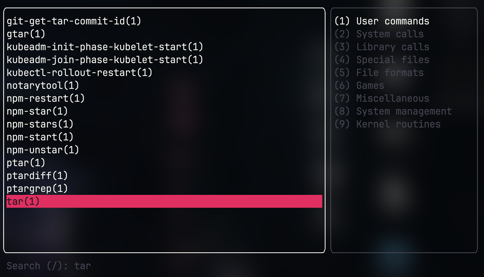
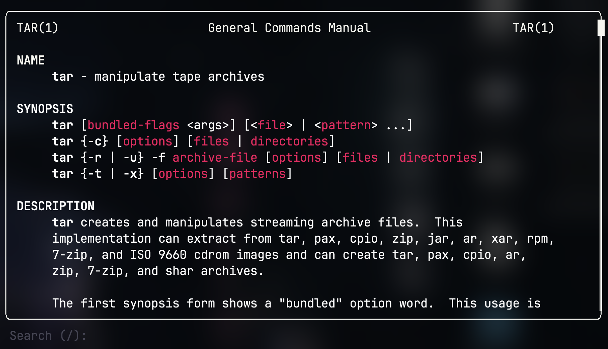

# Mantui

An interactive TUI to browse and read man pages.

Written with [ratatui](https://github.com/ratatui/ratatui).


## Installation

### Brew

Install with brew
```
brew install preiter93/mantui/mantui
```

### Download Binary

Download the latest binary from the [releases page](https://github.com/preiter93/mantui/releases).

## Usage

To launch the application:
```
mantui
```

To view a specific man page, provide the command name:
```
mantui tar
```

Browse through sections and search through a list of man pages.



Read the man pages. Supports scrolling with the mouse and highlighting/copying text.



## Key bindings

| Action                         | Command                |
| ------------------------------ | ---------------------- |
| Scroll up/down                 | `j` / `k`              |
| Scroll half-page up/down       | `Ctrl + u` / `Ctrl + d`|
| Search                         | `/`                    |
| Go back                        | `Esc`                  |
| Select                         | `Enter`                |
